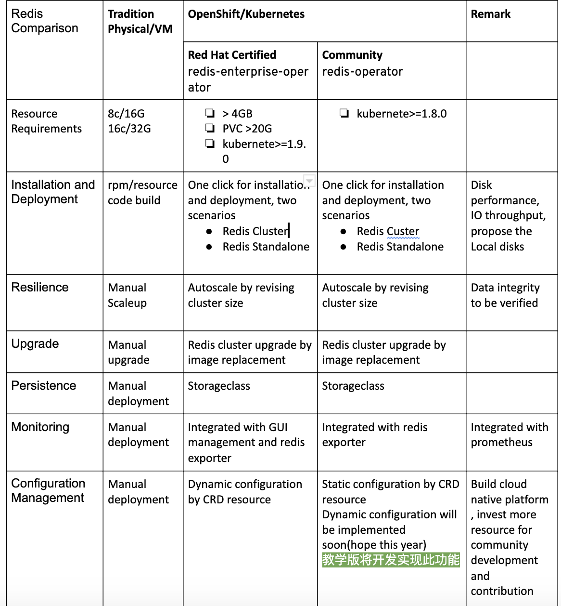

# Redis Operator
  This is a Red Hat OLM and Operator learning, development and training github repository, which inspired by the repo below:

[OT-CONTAINER-KIT Redis Operator](https://github.com/OT-CONTAINER-KIT/redis-operator)

- 功能比较

<div align="center">
    
</div>

# How to build and deploy redis operator 

Build and deploy redis-operator container image
```
make docker-build
make docker-push

make deploy 

#uninstall redis operator
make undeploy
```
Deploy the redis cluster 

```
kc -n redis-operator-system create -f example/redis-cluster-example.yaml

---
apiVersion: redis.redis.opstreelabs.in/v1beta1
kind: Redis
metadata:
  name: redis
spec:
  mode: cluster
  size: 3
  global:
    image: quay.io/chunzhan/redis:v6.2.3
    imagePullPolicy: IfNotPresent
    password: "Opstree@1234"
    resources:
      requests:
        cpu: 100m
        memory: 128Mi
      limits:
        cpu: 100m
        memory: 128Mi
  master:
    service:
      type: NodePort
    redisConfig:
      save:
        - "900 2"
        - "300 10"
        - "60 10000"
      timeout:
        - "5"
  slave:
    service:
      type: ClusterIP
    redisConfig: {}
  service:
    type: ClusterIP
  redisConfig: {}
  redisExporter:
    enabled: true
    image: quay.io/opstree/redis-exporter:1.0
    imagePullPolicy: Always
    resources:
      requests:
        cpu: 100m
        memory: 128Mi
      limits:
        cpu: 100m
        memory: 128Mi
  storage:
    volumeClaimTemplate:
      spec:
        storageClassName: standard
        accessModes: ["ReadWriteOnce"]
        resources:
          requests:
            storage: 1Gi
  tolerations:
  - key: "key1"
    operator: "Equal"
    value: "value1"
    effect: "NoSchedule"
```
Integrated with Operatorhub

```
# Generate olm bundle catalog 

make bundle

# Upgrading a bundle that was installed traditionally using OLM
oc create -f catalogsource.yaml

# catalogsource.yaml

apiVersion: operators.coreos.com/v1alpha1
kind: CatalogSource
metadata:
  name: redis operator
  namespace: default
spec:
  displayName: redis Operators
  image: quay.io/chunzhan/redis-operator-bundle:0.5.5
  sourceType: grpc

# Generate bundle index image 

opm index add --bundles quay.io/chunzhan/redis-operator-bundle:0.5.5  --tag quay.io/chunzhan/redis-operator-bundle-index:0.5.5 --container-tool docker

```
# Roadmap

- [ done ] Support the different redis configuration files by RedisConf crd for the master and slave nodes of redis cluster
- [ ] Support Dynamic redis configuration parameter for redis cluster by RedisConf crd
- [ ] Support tls
- [ ] More feature extension
- [ ] e2e tests

- Reference:

[gitlab-runner](https://gitlab.com/gitlab-org/gitlab-runner/blob/f4645bfbf947b761f69e8ba292bce84e5c95766d/executors/kubernetes/executor_kubernetes.go)
